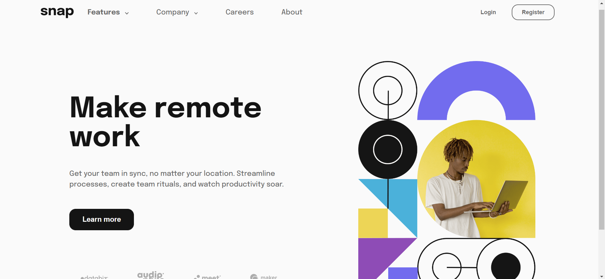

# Quiz 2 - Intro section page with interactive dropdown menu solution

This is a solution to the [Intro section page with interactive dropdown menu Quiz 2 challenge]

## Table of contents

- [Overview](#overview)
  - [The challenge](#the-challenge)
  - [Screenshot](#screenshot)
  - [Links](#links)
- [My process](#my-process)
  - [Built with](#built-with)
  - [What I learned](#what-i-learned)
  - [Continued development](#continued-development)
  - [Useful resources](#useful-resources)
- [Author](#author)
- [Acknowledgments](#acknowledgments)

## Overview

### The challenge

Users should be able to:

- View the relevant dropdown menus on desktop and mobile when interacting with the navigation links
- View the optimal layout for the content depending on their device's screen size
- See hover states for all interactive elements on the page

### Screenshot



### Links

- Solution URL: [Add solution URL here](https://your-solution-url.com)
- Live Site URL: [Add live site URL here](https://your-live-site-url.com)

## My process

### Built with

- HTML
- CSS custom properties
- Flexbox
- CSS Grid
- Javascript

### What I learned
I Mostly learned about the advanced CSS and basic javascript. Firstly, I learned that you can use root to make a variable for colors. such as 
```css
:root{
    --almostwhite: hsl(0, 0%, 98%);
    --mediumgray: hsl(0, 0%, 41%);
    --almostblack: hsl(0, 0%, 8%);
}
```

Since I am not really familiar with javascript a lot, this code really helps me to build the website for final project.
```
menu.addEventListener('click',function(){
    menu.parentElement.classList.toggle('open');
    document.body.classList.toggle('nav-open');
})

dropdown.forEach(function(item){
    item.addEventListener('click',function(){
        item.parentElement.classList.toggle('link-open');
    })
})
```

### Continued development

There are few things that i would like to improve the website, especially in adjusting the position, margin, padding for the images and texts.

### Useful resources

- [W3Schools](https://www.w3schools.com/) - This really help me to remind how to use the HTML, CSS and Javascript codes.
- [Youtube](https://www.youtube.com) - This website really help me to give the visual of examples websites. Thus, I used and impelemented the code to  give the best visual for the website.


## Your Detail 

- FullName - Davin Neilson
- StudentID - 2602119133
- BINUS Email - davin.neilson@binus.ac.id

## Acknowledgments

Youtube and W3School are both best websites to start your coding from the beginning.
